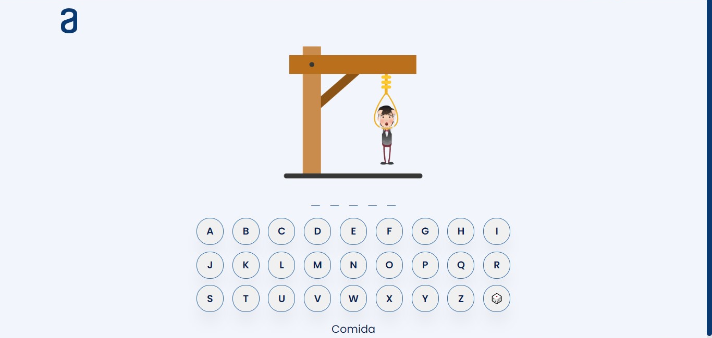

<div align="center">
  
  
  
  
  
  
  
  
  
  
  
  
  
  
  
  
  

  <h2 align="center">Juego del ahorcado</h2>

Este proyecto consiste adivinar una palabra antes de que se complete la imagen a los 5 intentos. Las líneas indicarán la cantidad de letras que tiene la palabra seleccionada aleatoriamente, además, no será posible ingresar números o caracteres especiales. ¡Que comience el juego!
  
### 📸 Captura de pantalla de demostración
  
</div>



<br/>

### ⭐ Prerequisítos

Antes de comenzar, asegúrate de haber cumplido con los siguientes requisitos:

* [Git](https://git-scm.com/downloads "Descargar Git") debe estar instalado en su sistema operativo.

### 🚀 Ejecutar el proyecto localmente

Para ejecutar el **Juego del ahorcado** localmente, ejecuta este comando en tu git bash o terminal:

Linux y macOS:

```bash
sudo git clone https://github.com/GeralNo/juego-del-ahorcado.git
```

Windows:

```bash
git clone https://github.com/GeralNo/juego-del-ahorcado.git
```

### 📫 Contácto

Si quieres contactárme puedes escribirme en [email](mailto:geraldinenovoa2709@gmail.com).

### 📃 Licencia

Este proyecto contiene una licencia: **MIT License**.